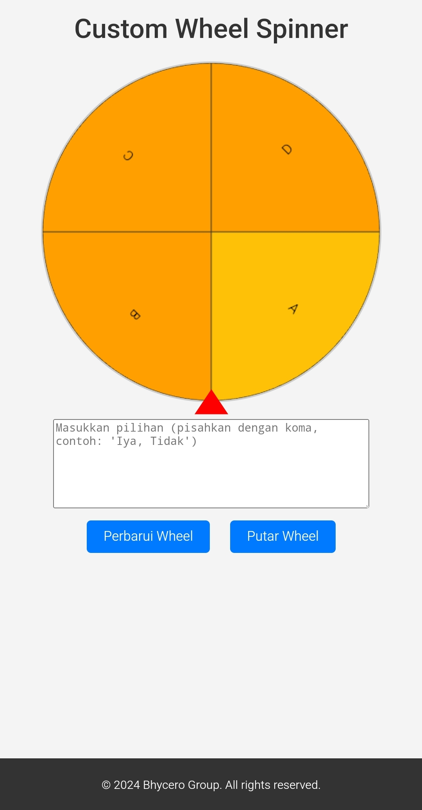

# Custom Wheel Spinner

Custom Wheel Spinner adalah aplikasi berbasis web sederhana untuk membuat roda putar (wheel spinner) yang dapat dikustomisasi sesuai keinginan pengguna. Aplikasi ini dirancang untuk memilih hasil secara acak dari daftar opsi yang dimasukkan.

## Fitur
- **Kustomisasi Segmen**: Tambahkan atau ubah pilihan sesuai keinginan.
- **Hasil Akurat**: Panah akan menunjuk langsung pada pilihan yang terpilih.
- **Desain Responsif**: Tampilan roda yang menarik dan dapat digunakan di berbagai perangkat.

## Teknologi yang Digunakan
- **HTML**: Struktur halaman.
- **CSS**: Gaya tampilan dan tata letak.
- **JavaScript**: Logika untuk animasi roda dan hasil.

## Cara Menggunakan
1. Buka situs [Bhycero Spinner](spinner.bhycerogroup.my.id) di browser.
2. Masukkan pilihan di kotak teks, pisahkan dengan tanda koma (,).
3. Klik tombol **Perbarui Wheel** untuk memperbarui roda.
4. Klik tombol **Putar Wheel** untuk memutar roda.
5. Panah akan berhenti pada pilihan yang terpilih.

## Screenshot
  
*Tampilan roda dengan panah.*

## Hak Cipta
&copy; 2024 Bhycero Group. Semua hak dilindungi undang-undang.

## Kontribusi
Kontribusi terbuka untuk semua pengembang. Jika ingin menambahkan fitur atau memperbaiki bug, silakan kirim pull request.

## Lisensi
Proyek ini dilisensikan di bawah [MIT License](https://opensource.org/licenses/MIT).